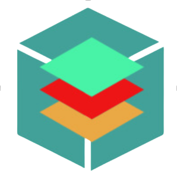

<link rel="stylesheet" href="https://use.fontawesome.com/releases/v5.6.1/css/all.css" integrity="sha384-gfdkjb5BdAXd+lj+gudLWI+BXq4IuLW5IT+brZEZsLFm++aCMlF1V92rMkPaX4PP" crossorigin="anonymous">

    
    <h2 style="font-weight: bold">Minh Tri Bui</h2>
    

    
    
     
    
    

 

# 🇸🇬 About Me
Both **Student** and **Software Engineer** situated in Singapore

I'm also a:
- **Game Developer**
- **Discord Bot Developer**

---

## ‍💻 Known Coding Languages and Tools

  &nbsp;
  &nbsp;
  &nbsp;
  &nbsp;
  &nbsp;
  &nbsp;
  &nbsp;

---

## 🔥 My Statistics

